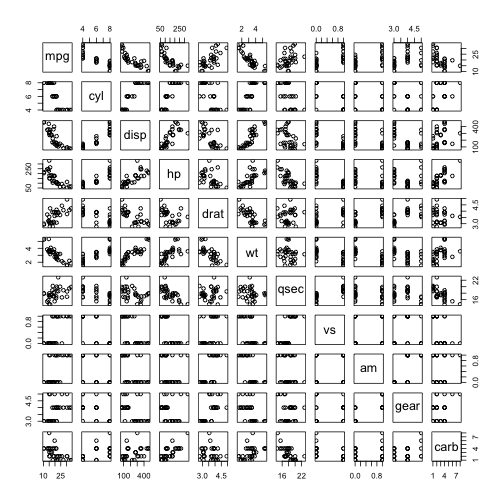

Coursera Presentation for Data Products
========================================================
author: Neal G 
date: Aug 13, 2016

Introduction
========================================================
This presentation is part of the required courserwork for the coursera 
Developing Data Products.  

This peer assessed assignment has two parts. First, you will create a Shiny application and deploy it on Rstudio's servers. Second, you will use Slidify or Rstudio Presenter to prepare a reproducible pitch presentation about your application.

Why are we here
========================================================

The outcome of this project is to demonstrate basic skill in providing a web enabled (html5) applicaiton, and its supporting presentaion slidedeck.  

I chose to reuse a project from the regression class, the linerar model regression of the Mtcars dataset.. 

This dataset is included with R, and is provided by Motor Trend.

It is located at https://locarz.shinyapps.io/ddp-project/

Sample of running R within Rpres
========================================================

For example, here is a pairwise plot of the dataset.  It's a nice way to quickly and visually explore the dataset..


```r
pairs(mpg ~ ., data = mtcars)
```



Review.  What have we demonstrated
========================================================
1. Shiny is a very flexiable tool for buiding interactive R applications
2. Slidify is a great tool for quick presentations
3. Rpub is a super easy way to deploy presentation from Sidify, when it works lol.
4. Rpres is what I ended up using as Slidify failed to render on Rpub.


Thanks to all the instructors :)


